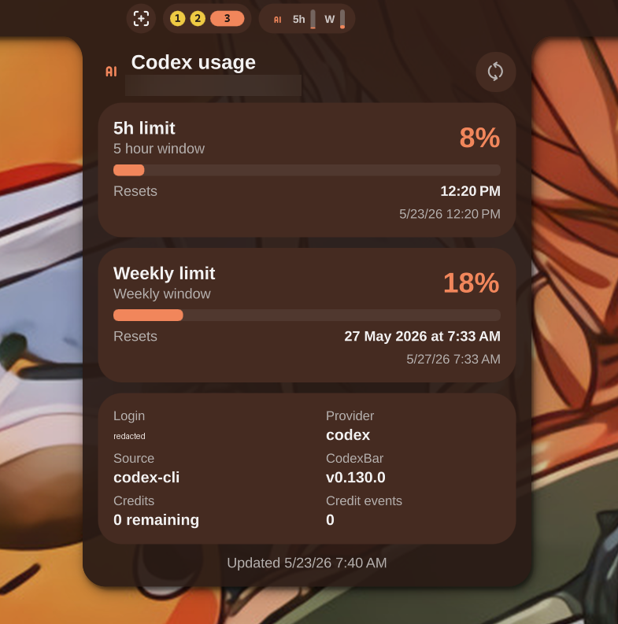

# Codex Usage for Noctalia

A compact Noctalia/Quickshell plugin that shows OpenAI Codex usage limits in the Noctalia bar and opens an attached details panel on click.



## Features

- Compact bar gauges for the Codex 5 hour and weekly limits.
- Left-click opens a Noctalia-style attached details panel.
- Right-click refreshes usage data.
- Details panel with horizontal usage bars and reset times.
- Metadata from CodexBar: account, login method, provider/source, version, credits, credit events, and update time.
- Settings UI for the CodexBar executable path, source mode, and polling interval.

## Dependency: CodexBar

This plugin is a UI wrapper around the [`codexbar`](https://github.com/steipete/codexbar) CLI. It does not try to parse OpenAI/Codex auth, cookies, sessions, or quota pages itself.

Default command:

```bash
codexbar usage --provider codex --source cli --format json
```

That is deliberate:

- CodexBar owns provider/auth/session details.
- This plugin stays small and focused on Noctalia UI.
- If OpenAI changes quota internals, users can update CodexBar without updating this plugin.

## Settings

Default settings:

```json
{
  "refreshIntervalSec": 60,
  "codexbarPath": "codexbar",
  "codexbarSource": "cli"
}
```

If Noctalia/Quickshell does not inherit your shell `PATH`, set `codexbarPath` to an absolute path:

```json
{
  "codexbarPath": "/home/you/.local/bin/codexbar"
}
```

`codexbarSource` is passed to `--source`. The default is `cli` because it works from local Codex CLI state. If your CodexBar setup uses another supported source, set it to that value.

Verify the dependency manually:

```bash
codexbar usage --provider codex --source cli --format json
```

The output must be valid JSON.

## Install

Install from the Noctalia plugin manager once the plugin is listed, or copy/clone this repository into Noctalia's plugin directory:

```bash
mkdir -p ~/.config/noctalia/plugins
git clone https://github.com/rayoplateado/noctalia-codex-usage ~/.config/noctalia/plugins/codexbar-usage
```

Enable it in `~/.config/noctalia/plugins.json`:

```json
{
  "states": {
    "codexbar-usage": {
      "enabled": true,
      "sourceUrl": "local"
    }
  }
}
```

Reload Noctalia/Quickshell if hot reload does not pick it up.

## Local development

Sync this repo into Noctalia:

```bash
rsync -a --delete ./ ~/.config/noctalia/plugins/codexbar-usage/
```

## Files

- `manifest.json` — Noctalia plugin metadata and entry points.
- `BarWidget.qml` — compact bar widget.
- `Panel.qml` — attached detail panel.
- `Settings.qml` — Noctalia settings UI for command path, source, and refresh interval.
- `codexbar.js` — shared CodexBar command construction and JSON parsing.
- `settings.json` — default/local settings.

## License

MIT
